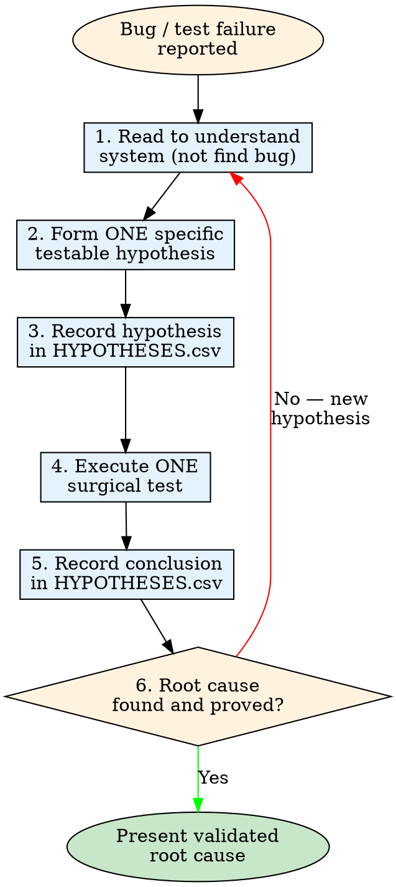

# Hypothesis Debugging

## Overview

Debug by forming specific, testable hypotheses, testing them one at a time, and recording every result in HYPOTHESES.csv. Each hypothesis must be precise enough that a single experiment proves or disproves it. Continue the loop until the root cause is found and validated.

## When to Use

- Bug you can reproduce but can't explain
- Test failure with no obvious cause
- Intermittent / non-deterministic failures
- Multiple possible root causes — isolate systematically
- Previous debugging attempts failed — need structured approach

**When NOT to use:** Blatant syntax errors, import mistakes, and trivial typos visible at a glance. For those, fix directly.

## The Hypothesis-Debugging Loop

This is the core process. Follow it in order. DO NOT skip any step.



### Quick Reference

| Step | Action | Output |
|------|--------|--------|
| 1 | Read codebase to understand SYSTEM (not find bug) | Expected vs actual behavior gap |
| 2 | Form ONE specific, testable hypothesis | A guess about WHY the gap exists |
| 3 | Record in HYPOTHESES.csv | Row with hypothesis + test, empty conclusion |
| 4 | Execute ONE surgical test | Clear result: proved or disproved |
| 5 | Record conclusion in HYPOTHESES.csv | proved / disproved / need more info |
| 6 | Found and proved? STOP. Else → loop to Step 1 | Validated root cause or next hypothesis |

### Step 1: Read to Understand the System

Read the codebase, tests, error messages, logs, and config. **Your goal is to understand the system — what it should do and what it actually does — NOT to find the bug.**

Understand:
- **Expected behavior:** What does the test/spec say should happen?
- **Actual behavior:** What does the output show? Reproduce the failure.
- **System structure:** Components, data flow, inputs/outputs, interfaces.

If you spot a potential bug while reading, do NOT act on it yet. Note it mentally. It will inform your hypothesis in Step 2.

### Step 2: Form Exactly One Hypothesis

Based on ALL available information, make the single most probable, specific, testable hypothesis about the root cause.

**A hypothesis is a guess about WHY the gap exists between expected and actual behavior.** It is NOT a restatement of what you observed in the code.

| Criterion | Good | Bad |
|-----------|------|-----|
| **Specific** | "The cache doesn't invalidate on writes" | "Something is wrong with caching" |
| **Testable** | "A cache-miss counter would increase on every write" | "The architecture is flawed" |
| **Probable** | Evidence points to this component | Random guess with no support |

### Step 3: Record Hypothesis in HYPOTHESES.csv

Append a row to HYPOTHESES.csv in the project root:

```csv
hypothesis,test,conclusion,notes
"Your specific testable hypothesis","One surgical test that will prove or disprove it",,  ← leave conclusion empty
```

**NEVER skip this file.** It is your audit trail. Without it you will repeat tests and lose evidence.

### Step 4: Execute One Surgical Test

Run ONE test, add ONE logging statement, or make ONE probe that directly tests the hypothesis. **NEVER test multiple hypotheses at once.**

The test must:
- Test ONLY this hypothesis
- Produce a clear result: proved or disproved
- Be the MINIMUM work needed to test it

### Step 5: Record the Conclusion

Update HYPOTHESES.csv with the result:

| Conclusion | Meaning |
|-----------|---------|
| **proved** | Evidence confirms this IS the root cause |
| **disproved** | Evidence rules this out as the root cause |
| **need more info** | Test was inconclusive — note what's missing |

### Step 6: Decide

- **Root cause proved?** → STOP. Present the root cause to the user.
- **Not yet found?** → Return to Step 1. Use the new knowledge from your test to form the next, more informed hypothesis.

## HYPOTHESES.csv Format

Create this file in the project root. Every hypothesis and its result lives here.

```csv
hypothesis,test,conclusion,notes
"The cache isn't invalidated on write","Add cache-miss counter before and after write","disproved","Cache hit rate unchanged — cache IS being invalidated"
"Tax calculated on undiscounted subtotal","Run test with taxable=subtotal-discount","proved","Root cause: line 33 in shopping_cart.py"
"The filter skips odd IDs","Test filter with [1,2,3,4]","proved","Root cause: modulo check uses `id % 2 == 0` instead of `id % 2 == 1`"
```

Rows with empty `conclusion` = hypotheses still pending. Rows with `proved` = validated root causes. Rows with `disproved` = eliminated possibilities.

## Before vs After

### Without Hypothesis Debugging (jump to fix)

```
1. Read shopping_cart.py
2. Read test_shopping_cart.py
3. See taxable = subtotal
4. Fix: change to taxable = subtotal - discount_amount
→ Fixed, but no proof this was THE root cause or that other bugs don't exist
```

### With Hypothesis Debugging (systematic)

```
1. Read codebase
2. Form hypothesis: "Tax uses undiscounted subtotal"
3. Record: HYPOTHESES.csv
4. Test: Modify taxable and run test_discount_applied_correctly
5. Record: HYPOTHESES.csv — conclusion=proved, notes="Root cause: line 33"
6. STOP — present root cause
→ Bug fixed AND root cause is documented and verified
```

## Common Mistakes

| Mistake | Why it's wrong | Instead |
|---------|---------------|---------|
| Testing 2+ hypotheses at once | Can't tell which caused the result | Run one test per hypothesis |
| Vague hypothesis | Not testable | Make specific: "X crashes when Y is null" |
| Skipping HYPOTHESES.csv | No audit trail, repeat tests | Always write before testing |
| Ignoring disproved results | Lose evidence, reach wrong conclusion | Record ALL results — disproved = progress |
| Jumping to fix without hypothesis | Fix wrong thing, waste time | Form hypothesis first, test, then fix |
| Loop forever on inconclusive tests | Test is too broad | Isolate one variable — make test more surgical |
| **Identifying bug during step 1 and calling that a hypothesis** | That's an observation, not a hypothesis | Still form the hypothesis about WHY the gap exists, test it, prove it |

## Red Flags — You're Not Following the Loop

- You modified code before writing a hypothesis
- You changed two things at once
- You haven't created HYPOTHESES.csv
- You can't articulate a specific, testable hypothesis
- You tested without recording the hypothesis first
- You got a result and didn't update HYPOTHESES.csv
- You found something and stopped without proving it's the root cause

## Common Rationalizations

| Rationalization | Reality |
|----------------|---------|
| "I see the bug while reading — that's my hypothesis" | Seeing a code issue is an observation, not a hypothesis. Still record, test, and prove it. |
| "The bug is obvious from reading" | Obvious bugs still need verification. Without a test you're guessing, not debugging. |
| "I don't need to write it down — I'll remember" | You won't. And you lose the audit trail. HYPOTHESES.csv is mandatory. |
| "I'll form the hypothesis after I fix it" | That's post-hoc documentation, not debugging. Form BEFORE testing. |
| "The test is too simple to go through the loop" | Simple bugs need verification too. The loop takes 30 seconds. |
| "I already know the answer from reading" | Then prove it. A proved hypothesis is evidence. An untested observation is speculation. |

## Combining With Other Skills

| Skill | How they combine |
|-------|-----------------|
| systematic-debugging | Use hypothesis-debugging for forming/testing hypotheses within the broader debug workflow |
